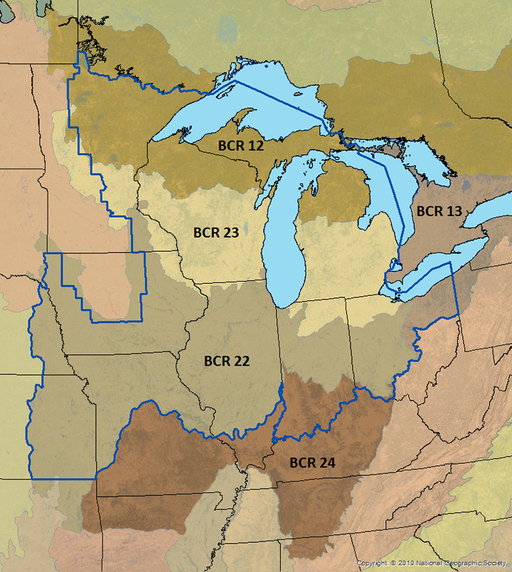

In the last post about eBird data I went through how I acquired, cleaned, and explored the dataset. In this project, I am exploring how the eBird data can be used to model the encounter rate of the White Breasted Nuthatch in Minnesota. As with the last post, I have been heavily referencing the eBird best practices eBook. 

There are a lot of libraries so you can find them in the session info at the bottom.

#### Setup

```{r Load Libraries, include=FALSE}
library(sf)
library(raster)
library(dggridR)
library(lubridate)
library(ranger)
library(scam)
library(PresenceAbsence)
library(verification)
library(ebirdst)
library(fields)
library(gridExtra)
library(tidyverse)
library(here)
library(ghibli)
library(rsample)
library(pdp)
library(vip)
library(patchwork)


library(doParallel)
all_cores <- parallel::detectCores(logical = FALSE)
registerDoParallel()

# resolve namespace conflicts
select <- dplyr::select
map <- purrr::map
projection <- raster::projection
```

First we will set the paths to our datasets

```{r Paths to Relevant Files}
# Random Seed
set.seed(5)

# Data Files and Output Directory
output_dir <- here("output")
ebird_file <- here("data", "ebd_whbrnuthatch_yearround_mn_zf.csv")
habitat_file <- here("data", "pland-elev_location-year.csv")
pred_surf_file <- here("data", "pland-elev_prediction-surface.csv")
surface_tif_file <- here("data", "prediction-surface.tif")
geopackage_file <- here("data", "gis-data.gpkg")
```

And now we can load our files.

```{r Load eBird and Geo Data, results='hide'}
# Load eBird data
ebird <- read_csv(ebird_file) %>% 
  mutate(year = year(observation_date)) # Get Year for joining with habitat data

# MODIS habitat covariates
habitat <- read_csv(habitat_file) %>% 
  mutate(year = as.integer(year))

# combine ebird and habitat data
ebird_habitat <- inner_join(ebird, habitat, by = c("locality_id", "year"))

# Load the prediction surface
pred_surface <- read_csv(pred_surf_file)
max_lc_year <- max(pred_surface$year)
prediction_surface_raster <- raster(surface_tif_file)

# Load GIS data from geopackage
map_proj <- st_crs("ESRI:102003")
ne_land <- read_sf(geopackage_file, "ne_land") %>% 
  st_transform(crs = map_proj) %>% 
  st_geometry()
mn <- read_sf(geopackage_file, "mn") %>%
  st_transform(crs = map_proj) %>%
  st_geometry()
ne_country_lines <- read_sf(geopackage_file, "ne_country_lines") %>% 
  st_transform(crs = map_proj) %>% 
  st_geometry()
ne_state_lines <- read_sf(geopackage_file, "ne_state_lines") %>% 
  st_transform(crs = map_proj) %>% 
  st_geometry()
mn_bound <- read_sf(here("data", "bdry_state_of_minnesota.gpkg")) %>% 
  st_transform(crs = map_proj) %>% 
  st_geometry()
```

#### Data Subsampling and Spatial Bias

Here we will implement grid based undersampling, which is primarily a method for countering spatial bias in data. Unlike non-spatial data sets, spatial data does not usually obey the statistical idea of sampling from an independent and identically distributed random variable. You can think about it this way - Starbucks are not evenly distributed throughout a state, they appear in population centers. As a result, the parameters of the sample (the location) affect the probability that we will observe something. This becomes a major problem in eBird data, where most checklists are completed near where the person completing the checklist lives, so the actual checklists are clustered around population centers. If you look at the map at the end of my last eBird post, this trend is clear. One way to counter this is to subsample checklists in a grid. This can also be used to fix some class imbalance issues by subsampling according to whether or not the checklist observed the species in question. In the eBird Best Practices book, they look at the Wood Thrush, a rarer species than the White-Breasted Nuthatch. They also look at a much larger area than Minnesota - so we will adjust some of the parameters to match our scenario.

I also trained the model on the whole data set and model performance on the test set was consistently stronger on the whole data set versus the sub-sampled data set. This was somewhat surprising to me, as both eBird best practices and the linked paper (ADD HERE) suggested that the reduction of spatial bias would increase model accuracy when predicting encounter rate from land cover covariates. Perhaps this effect is small for a species without a big class imbalance, and so the reduction in model performance from the decrease in overall data has a larger effect than the spatial bias?

```{r Grid Based UnderSampling}

dggs <- dgconstruct(spacing = 1)
checklist_cell <- ebird_habitat %>% 
  mutate(cell = dgGEO_to_SEQNUM(dggs, longitude, latitude)$seqnum,
         year = year(observation_date),
         week = week(observation_date))
ebird_ss <- checklist_cell %>% 
  group_by(species_observed, year, week, cell) %>% 
  sample_n(size = 1) %>% 
  ungroup()

# original data
count(ebird_habitat, species_observed) %>% 
  mutate(percent = n / sum(n))

# subsampled data
count(ebird_ss, species_observed) %>% 
  mutate(percent = n / sum(n))


```
This process would reduce our data by a factor of about 2, while slightly increasing the proportion of checklists with a sighting. 

Note - for the reasons explained above, the rest of the post performs the analysis without sub-sampling. 

### Train and calibrate the model

Next, since we will be building a random forest model to estimate encounter rate, I split the data into train and testing sets. For this analysis we will focus on the month of May, which had altogether the most sightings of Nuthatches (and the most checklists), but not the highest proportion of checklists with a sighting among months. Note that here I am selecting a subset of the variables, specifically the landcover and elevation covariates as well as the year and day. 


```{r Split into Train/Test}
ebird_split <- ebird_habitat %>%
    mutate(month = month(observation_date, label = FALSE),
         species_observed = species_observed) %>%
    filter(month == 5) %>%
    select(species_observed, 
           year, 
           day_of_year,
           starts_with("pland_"),
           starts_with("elevation_")) %>% 
    drop_na()
  
# split 80/20
ebird_split <- rsample::initial_split(
  ebird_split,
  prop = 0.8 
)

ebird_train <- training(ebird_split) 
ebird_test <- testing(ebird_split)

ebird_train_label <- pull(ebird_train, species_observed)
ebird_train <- ebird_train %>%
  select(-species_observed)
ebird_test_label <- pull(ebird_test, species_observed)
ebird_test <- ebird_test %>%
  select(-species_observed)


```

Finally we will train our random forest - using some sensible defaults. 

```{r Train Ranger, results="hide"}
ebird_train_rf <- bind_cols(ebird_train_label, ebird_train) %>%
    rename(species_observed = "...1")
rf <- ranger(formula =  as.factor(species_observed) ~ ., 
             data = ebird_train_rf,
             importance = "impurity",
             probability = TRUE,
             replace = TRUE, 
             sample.fraction = c(.3, 0.3))
```
We can check the calibration of the model by plotting the predicted encounter rate against the observed encounter rate. Additionally we can smooth the output of our model by fitting a generative additive model (a version of non-linear spline regression) from the predictions of the random forest to the observed encounter labels. 

```{r Calibration Model}
rf_calib_data <- tibble(
    observed = ebird_train_label,
    rf_pred = rf$predictions[,2]
)

rf_calibration <- scam(observed ~ s(rf_pred, k = 7, bs = "mpi"), 
                       gamma = 1.4,
                       data = rf_calib_data)

average_encounter <- rf_calib_data %>%
  mutate(pred_cat = cut(rf_calib_data$rf_pred, breaks = seq(0, 1, by=0.02))) %>%
  group_by(pred_cat) %>%
  summarise(pred = mean(rf_pred), train_label = mean(observed), checklist_count = n()) %>%
  ungroup()

# plot
rf_cal_pred <- tibble(rf_pred = seq(0, 1, length.out = 100)) %>%
    mutate(calibrated = predict(rf_calibration, ., type = "response"))

ggplot(rf_cal_pred) +
  aes(x = rf_pred, y = calibrated) +
  geom_line() +
  geom_point(data = average_encounter, 
             aes(x = pred, y = train_label, size = sqrt(checklist_count)),
             show.legend = FALSE, shape = 1) +
  labs(x = "Estimated Encounter Rate",
       y = "Observed Encounter Rate",
       title = "Calibration Curve") +
    theme_bw()


```

What I can see here is that our model consistently overestimates the encounter rate. At an estimated encounter rate of 0.5 the observed rate is only half that. The model does a better job near the upper limit of predicted encounter rate. This means that We can now calculate some model performance metrics on the held-out test set.

```{r Model Metrics}

rf_fitted <- tibble(rf_pred = predict(rf, data = ebird_test)$predictions[,2],
                    obs = as.integer(ebird_test_label)) %>%
    mutate(model_pred_cal = predict(rf_calibration, ., type = "response")) %>%
    mutate(rf_pred = pmin(pmax(rf_pred, 0), 1),
           model_pred_cal = pmin(pmax(model_pred_cal, 0), 1)) %>%
    mutate(id = seq_along(rf_pred),
           obs = as.integer(as.logical(obs))) %>%
    drop_na() %>%
    rename(
        fit = rf_pred,
        cal = model_pred_cal
    ) %>%
    relocate(obs) %>%
    relocate(id)

# mean squared error (mse)
mse_fit <- mean((rf_fitted$obs - rf_fitted$fit)^2, na.rm = TRUE)
mse_cal <- mean((rf_fitted$obs - rf_fitted$cal)^2, na.rm = TRUE)

# pick threshold to maximize kappa
opt_thresh <- optimal.thresholds(rf_fitted, opt.methods = "MaxKappa")

# calculate accuracy metrics: auc, kappa, sensitivity, specificity,
metrics_fit <- rf_fitted %>% 
  select(id, obs, fit) %>% 
  presence.absence.accuracy(threshold = opt_thresh$fit, 
                            na.rm = TRUE, 
                            st.dev = FALSE)
metrics_cal <- rf_fitted %>% 
  select(id, obs, cal) %>% 
  presence.absence.accuracy(threshold = opt_thresh$cal, 
                            na.rm = TRUE, 
                            st.dev = FALSE)

rf_assessment <- tibble(
  model = c("RF", "Calibrated RF"),
  MSE = c(mse_fit, mse_cal),
  Sensitivity = c(metrics_fit$sensitivity, metrics_cal$sensitivity),
  Specificity = c(metrics_fit$specificity, metrics_cal$specificity),
  AUC = c(metrics_fit$AUC, metrics_cal$AUC),
  Kappa = c(metrics_fit$Kappa, metrics_cal$Kappa)
)
knitr::kable(rf_assessment, digits = 3) 
```
The GAM-calibrated forest has a small decrease in MSE but in general does not affect the metrics of the random forest. 

### Variable Importance

One of the major benefits of forest based models is the ability to rank the importance of an individual variable. The `vip` function ranks variables by their mean contribution to the overall model in terms of their gini index. This plot is shown here:


```{r Variable Importance Plot}
vip(rf) + 
    theme_bw() + 
    labs(title = "Random Forest Variable Importance") +
    ylab("Importance (Gini Index)")

```
The two most important variables (by this metric) are the two elevation variables. This may make some sense - as nuthatches are less common in the prairies and croplands in the Western part of Minnesota. Going even further, we can observe how changing an individual variable (while keeping all other constant) affects the model's predicted encounter rate. This is called a partial dependence plot - and it can be a useful tool for checking assumptions about a variable. 


```{r}
format_pdp_plot <- function(model, variable) {
    plot <- pdp::partial(model, pred.var = variable, plot = TRUE, plot.engine = "ggplot2")
    plot <- plot +
        theme_bw() + 
        theme(
            panel.grid = element_blank(),
            axis.title.y = element_blank()
        )
        
    return (plot)
}
pdp1 <- format_pdp_plot(rf, "elevation_median")
pdp2 <- format_pdp_plot(rf, "elevation_sd")
pdp3 <- format_pdp_plot(rf, "day_of_year")
pdp4 <- format_pdp_plot(rf, "pland_09_savanna")
pdp5 <- format_pdp_plot(rf, "year")
pdp6 <- format_pdp_plot(rf, "pland_13_urban")
pdp7 <- format_pdp_plot(rf, "pland_08_woody_savanna")
pdp8 <- format_pdp_plot(rf, "pland_12_cropland")
pdp9 <- format_pdp_plot(rf, "pland_10_grassland")
```

```{r PDP plot, warning=FALSE}
combined_pdp <- (pdp1 + pdp2 + pdp3) / (pdp4 + pdp5 + pdp6) / (pdp7 + pdp8 + pdp9)

combined_pdp + plot_annotation(
  title = 'Partial Dependence Plots',
  subtitle = 'The top 9 variables ranked by importance in the random forest'
)
```
There are a few interesting trends here:
 + The model predicts a higher encounter rate when the elevation is higher, and when the standard deviation of the elevation in a near a checklist is higher.
 + The cropland and woody savanna partial dependence plots appear to be mirrors of each other.
 + Lower predicted encounter rates in all urban areas.
 + A depressing decrease in encounter rate from 2010-2019 (this could also be interpreted as an overall increase in eBird data resulting in more checklists from backyard birders who may be less likely to see a Nuthatch).
 + A higher predicted encounter rate later in the month of May - does breeding season start later for the Nuthatch?
 
As with most plots of regression variables on their own - extreme caution should be taken when trying to interpret these causally. The calculation of a pdp holds every other variable constant, so we lose any interation between the variables. 

## Plotting Encounter Rate

And finally - let's plot the predicted encounter rate as a raster map on Minnesota. Essentially we want to associate each grid cell in Minnesota with the land and elevation variables. For this plot we will fix the month and the day of the year.

```{r Encounter rate data frame}
# add effort covariates to prediction 
pred_surface_eff <- pred_surface %>% 
    mutate(month = 5,
           day_of_year = 15) %>%
    relocate(month, .before = year) %>%
    relocate(day_of_year, .after = year)

pred_surface_loc <- tibble(
    id = pred_surface_eff$id,
    longitude = pred_surface_eff$longitude,
    latitude = pred_surface_eff$latitude
)

pred_rf <- predict(rf, data = as.matrix(pred_surface_eff), type = "response")
    
pred_rf <- pred_rf$predictions[, 2]
# apply calibration models
pred_rf_cal <- tibble(pred_rf_cal = predict(rf_calibration, 
                       data.frame(rf_pred = pred_rf), 
                       type = "response"))
# add to prediction surface
pred_er <- bind_cols(pred_surface_loc, encounter_rate = pred_rf_cal$pred_rf_cal) %>% 
  select(latitude, longitude, encounter_rate) %>% 
  mutate(encounter_rate = pmin(pmax(encounter_rate, 0), 1))
```

Then we turn that prediction data frame into spatial features and then rasterize it. Finally, we project the raster into the format the map is expecting.

```{r warning=FALSE}
r_pred <- pred_er %>% 
  st_as_sf(coords = c("longitude", "latitude"), crs = 4326) %>% 
  st_transform(crs = projection(prediction_surface_raster)) %>% 
  rasterize(prediction_surface_raster)
r_pred <- r_pred[[-1]]
r_pred_proj <- projectRaster(r_pred, crs = map_proj$proj4string, method = "ngb")

r_pred_proj_spdf = as(r_pred_proj, "SpatialPixelsDataFrame")
raster_df <- as.data.frame(r_pred_proj_spdf)
```

And plot it - with a similar zooming method that I used in the last ebird post.

```{r, warning=FALSE}

get_display_window <- function(lat, long, zoom) {
  zoom_to <- c(lat, long)
  zoom_level <- 5
  
  # Lambert azimuthal equal-area projection around center of interest
  target_crs <- map_proj$proj4string
  
  C <- 40075016.686   # ~ circumference of Earth in meters
  x_span <- C / 2^(zoom_level+0.5)
  y_span <- C / 2^(zoom_level+0.95)
  
  zoom_to_xy <- st_transform(st_sfc(st_point(zoom_to), crs = 4326),
                             crs = target_crs)
  
  disp_window <- st_sfc(
      st_point(st_coordinates(zoom_to_xy - c(x_span / 2, y_span / 2))),
      st_point(st_coordinates(zoom_to_xy + c(x_span / 2, y_span / 2))),
      crs = target_crs
  )
  window_crs <- list(window = disp_window, crs = target_crs)
  return(window_crs)
}

window_crs <- get_display_window(-94.3114, 46.278594, 5)

raster_df %>%
    ggplot(data = .) + 
    geom_sf(data = ne_land, color = "white") + 
    geom_sf(data = ne_country_lines, color = "white") + 
    geom_sf(data = ne_state_lines, color = "white") + 
    geom_sf(data = mn_bound, color = "black", size = 1.5) + 
    geom_raster(mapping = aes(x = x, y = y, fill = encounter_rate)) + 
    coord_sf(xlim = st_coordinates(window_crs$window)[,'X'],
             ylim = st_coordinates(window_crs$window)[,'Y'],
             crs = window_crs$crs, datum = window_crs$crs) + 
    scale_fill_ghibli_c("YesterdayMedium") + 
    theme_bw() + 
    labs(title = "White-Breasted Nuthatch Encounter Rate", 
         subtitle = "Minnesota, May",
         caption = "Scale corresponds to probability of encounter at given location.",
         fill = "Encounter\nRate") + 
    theme(panel.background = element_blank(),
          axis.text = element_blank(),
          axis.ticks = element_blank(),
          panel.grid = element_blank(),
          axis.title = element_blank()
          )

```
We observe a low predicted encounter rate in the western croplands. The the bulk of the region with high predicted encounter rates corresponds to [bird conservation region 23](https://nabci-us.org/resources/bird-conservation-regions-map/) (prairie-woodland transition) - seen below from the website [https://umgljv.org/planning/state-by-bcr-plans/](https://umgljv.org/planning/state-by-bcr-plans/). 

 

### Final thoughts

This post explored using eBird checklist data along with habitat variables to predict the chance of encountering the White Breasted Nuthatch in Minnesota. It would be interesting to explore these methods with a more rare species like the Hermit Thrush (one of my faves) - or to compare the encounter rate maps calculated for each month to published species extent maps. 

